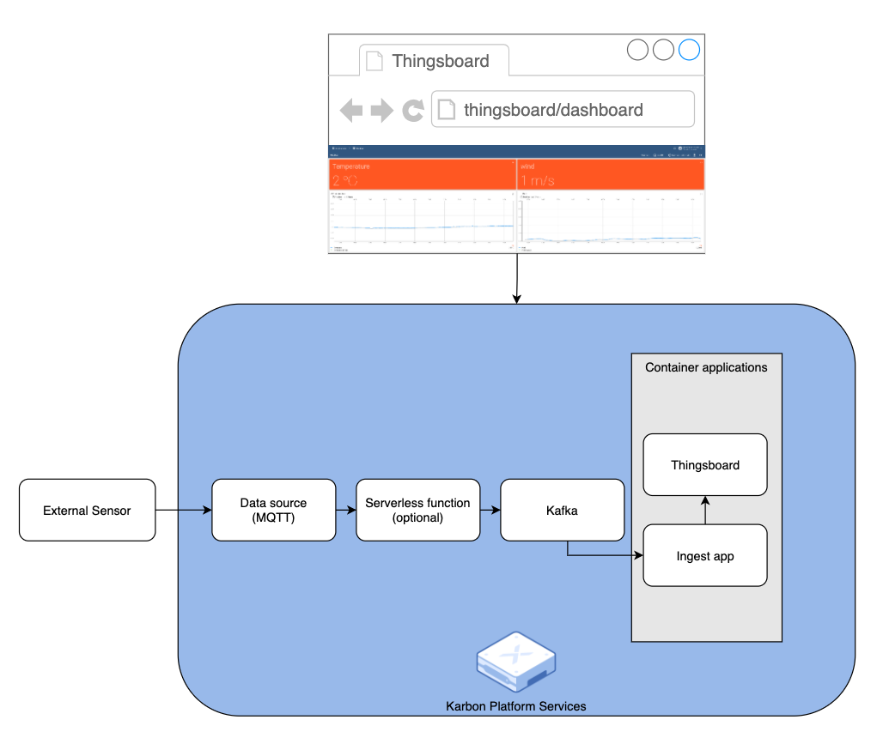

# Thingsboard on Nutanix Karbon Platform Services

## Introduction

This repository contains everthing you need to deploy [Thingsboard](https://thingsboard.io) on-top of Nutanix [Karbon Platform Services](https://www.nutanix.com/products/karbon/platform-services).

This deployment will let you quickly get up and runing with both Thingsboard and Karbon Platform Services.
The deployment consists of two parts, Thingsboard deployment and a Kafka to Thingsboard bridge.

## Step by step

