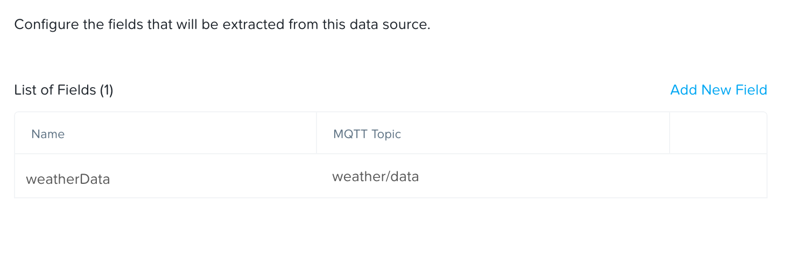
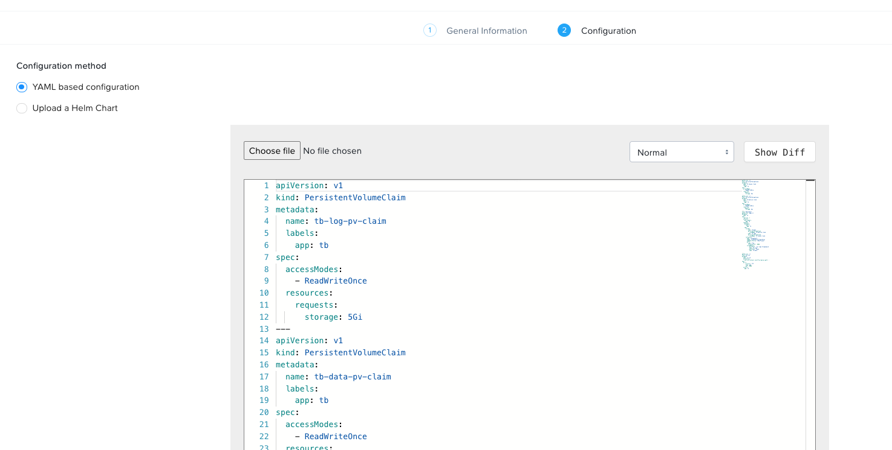

# Thingsboard on Nutanix Karbon Platform Services

## Introduction

This repository contains everthing you need to deploy [Thingsboard](https://thingsboard.io) on-top of Nutanix [Karbon Platform Services](https://www.nutanix.com/products/karbon/platform-services).

This deployment will let you quickly get up and runing with both Thingsboard and Karbon Platform Services.
The deployment consists of two parts, Thingsboard deployment and a Kafka to Thingsboard bridge.


___

## Step by step

### Step 1 - Create a project

> This step assumes you already have acces to Karbon Platform Services. If not and you want to try it out sign up at https://my.nutanix.com

Sign in to Karbon Platform Services [portal](https://karbon.nutanix.com). Open the ```Projects``` section in the menu on the left. Click on ```Create```.
Give your project a name and assign a user.  
Click ```Next```. Assign a service domain using ```Add service domain```.  
Click ```Next```.  
Enable services for our project.  
This project is making use of

* Kubernetes Apps
* Functions and Data Pipelines
* Ingress Controller - Traefik
* Data Streaming - Kafka, NATS

Click on ```Create```.

### Step 2 - Setup data source

Next we add a new data source. This is where the data enters the platform solution.
We will create a new category for our incoming data.
Open the ```Categories``` section in the menu and click ```Create```.  
Give the new category a name and click on ```Add value```.  
In my example I use ```IncommingData``` as name and add a value of ```weather```


Once we have our category setup we can add the data source.

Open the ```Data sources and IoT sensors``` section of the menu. Click on ```Add Data source```.  
Select ```sensor```, Give the data source a Name, a associated Service domain, select ```MQTT```as protocol.
Click ```Generate Certificates``` to generate .X509 certificates for device authentication. Download the certificates before clicking ```Next```. In the next step, add the MQTT Topic your sensor publishes it's data on.



Give the field a name.
In my example my sensor publishes on the MQTT topic ```weather\data``` and I name the field weatherData.

Click on ```Next```.  
Assign the incoming data to the category we created earlier in this step.


Click on ```Create```.

### Step 3 - Create a Data pipeline

Next step is to connect our data source to our kafka queue using a ```Data pipeline```.  
Select the project we created in step 1 from the drop-down at the top of the menu on the left.
Click on ```Functions and Data Pipelines``` in the menu and select the ```Data Pipelines``` tab.  
Click on ```Create```

Give the Data pipeline a Name  
Under ```Input``` select ```Data source``` and then ```IncommingData``` and ```weather``` category from step 2.  
Under ```Transformation``` select None.
Under ```Output``` select ```Publish to service domain```,  
select ```Kafka``` as Endpoint type and enter ```data``` as Endpoint Name.

This will create a Kafka topic called ```data``` automatically.

> It is important to name the endpoint ```data``` as this is referenced in the kafka consumer.

Click on ```Create``` down in the right corner.

### Step 5 - Deploy Kubernetes Applications

The next and final step is to deploy the kubernetes applications.

#### *Thingsboard*
Select ```Kubernetes Apps``` from the menu. Click on ```Create```.

Enter a name for our application.  
Select your Service Domain.
Click on ```Next``` down in the right corner.


Paste or upload the ```thingsboard.yaml``` file in the code area.



Click on ```Create``` down in the right corner.

This deployment will now deploy a single instance of Thingsboard using the image [thingsboard/tb-postgres](https://hub.docker.com/r/thingsboard/tb-postgres). This image includes a postgres database. The deployment creates a Persistent volume claim to persist data to the Service Domain.
A ingress route is created that points to the Thingsboard instance. Once the deployment is healthy you can access Thingsboard using http://IPTOYOURSERVICEDOMAIN/

#### *Kafak consumer*

This is a simple python application that consumes data from the Kafka service and inputs the data to Thingsboard using Thingsboards REST Api. It is available as an image (voxic/kttb) on dockerhub.

Before we can deploy the kafka consumer we need to set up a user in Thingsboard for API autentication.

Login to you Thingsboard instance (using http://iptoyouservicedomain).
Defult username and password is:  
User: sysadmin@thingsboard.org  
Password: sysadmin

*Create Tenant*

Click on ```Tenants```


Click on ```+``` out to the right.
Fill in tenant information and click on ```Add```.

*Creat user*

Click on ```Manage Tenant Admins``` on the right side


Click on ```+``` out to the right.  
Fill in user information, make sure to leave the option ```Activation method``` to ```Display activation link```.  
Click on ```Add```.  
Copy the ```Activation link```

Open a New Browser window or a Incognito tab and paste your activation link. Change ```localhost:8080``` to the IP of your Service Domain.
> Remove the :8080 part as well.

Create a password for the user.

*Create device*  
You should now be logged in as the Tenant Administrator that you just created.
Last step is to create a device in Thingsboard.
Click on ```Devices``` in the menu on the left.  
Click on ```+``` out to the right and then ```Add new device```.  
Name your device and click on ```Add``` down in the right corner.


We are now ready to deploy the Kafka consumer and start pushing data to ThingsBoard.

Head to the Karbon Platform Services [portal](https://karbon.nutanix.com). Go to you project created in step 1 using the drop down menu on the left.

Select ```Kubernetes Apps``` from the menu. Click on ```Create```.

Enter a name for our application.  
Select your Service Domain.
Click on ```Next``` down in the right corner.

Paste or upload the ```kafkaToTB.yaml``` file in the code area.
Scroll down the last section of the yaml and change the rows:

```yaml
            - name: TB_USER
              value: tbusername <---
            - name: TB_PASSWORD
              value: tbpassword <---
```

To the user credentials you created.

Click on ```Create``` down in the right corner.

The solution is now ready to accept data from a sensor.

### Send data to Karbon Platform Services

The Kafka consumer expects data to arrive as a JSON object with the following structure

```json

{
    "device":"dev001",
    "measurement":"temperature",
    "value":"0.3",
    "ts":1614801607246
}

```

If you don't have acces to sensors or other data sources I have created this simulator
https://github.com/voxic/weatherstation-simulation

To send data to the Service domain, publish data to the MQTT broker running on the Service Domain and the configured topic in Step 2. Autentication to the MQTT broker is done using the Certificates downloaded in Step 2.